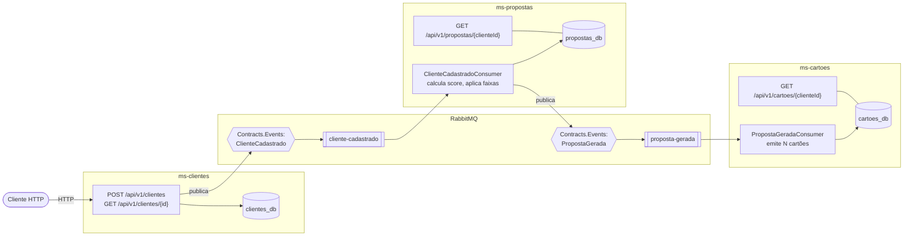

# ms-clientes

Microsserviço de cadastro de clientes. Expõe uma API REST para registrar e consultar
clientes e publica o evento `ClienteCadastrado` no RabbitMQ.

Parte de uma solução de três microsserviços:

Cada microsserviço é dono do seu banco. Nenhum serviço consulta a base de outro: toda
comunicação entre eles passa pelo RabbitMQ.

- [ms-clientes](https://github.com/leonarclo/ms-clientes) (este repositório)
- [ms-propostas](https://github.com/leonarclo/ms-propostas)
- [ms-cartoes](https://github.com/leonarclo/ms-cartoes)

## Responsabilidades

- Registrar clientes via API REST, validando CPF, e-mail e campos obrigatórios
- Garantir unicidade de CPF e e-mail
- Consultar cliente por id
- Publicar `ClienteCadastrado` após a persistência

Este serviço não conhece propostas nem cartões. A comunicação com os demais é
exclusivamente por evento.

## Stack

| Componente | Versão |
|---|---|
| .NET | 10.0 |
| ASP.NET Core Web API | 10.0 |
| SQL Server | 2022 (container) |
| Dapper | 2.1.79 |
| Microsoft.Data.SqlClient | 7.0.2 |
| MassTransit | 8.5.10 |
| RabbitMQ | 4.x (container) |
| xUnit | 2.9.3 |

## Arquitetura

Clean Architecture com quatro projetos. As dependências apontam sempre para dentro:

    Clientes.Domain              sem referências externas
        ▲
    Clientes.Application         → Domain
        ▲            ▲
    Clientes.Api   Clientes.Infrastructure

| Projeto | Responsabilidade |
|---|---|
| `Clientes.Domain` | Entidade `Cliente`, validadores de CPF e e-mail |
| `Clientes.Application` | Casos de uso, DTOs, contratos de eventos, interfaces de repositório e publicação |
| `Clientes.Infrastructure` | Repositório Dapper, publicação via MassTransit |
| `Clientes.Api` | Controllers, tradução de exceções para HTTP |

O `Domain` não referencia Dapper, SQL Server, HTTP nem MassTransit. Isso é garantido
pelo `.csproj`, não por convenção: o projeto simplesmente não tem essas referências.

## Endpoints

### POST /api/v1/clientes

Requisição:

    {
      "nome": "João da Silva",
      "cpf": "123.456.789-09",
      "email": "joao@email.com",
      "dataNascimento": "1995-05-10"
    }

O CPF aceita formatação; é normalizado para 11 dígitos antes de gravar.

| Status | Situação |
|---|---|
| 201 | Cliente criado. Retorna o recurso e o header `Location` |
| 400 | CPF inválido, e-mail inválido ou campo obrigatório ausente |
| 409 | CPF já cadastrado |

### GET /api/v1/clientes/{id}

| Status | Situação |
|---|---|
| 200 | Cliente encontrado |
| 404 | Id inexistente |

## Como executar

Pré-requisitos: .NET SDK 10.0 e Docker.

### 1. Infraestrutura

O `docker-compose.yml` sobe SQL Server e RabbitMQ, compartilhados pelos três
microsserviços. O nome do projeto Compose é `parana-banco` nos três repositórios, então
executar `docker compose up -d` a partir de qualquer um deles gerencia a mesma stack.

    docker compose up -d

Aguarde os healthchecks ficarem `healthy`:

    docker compose ps

| Serviço | Porta do host | Uso |
|---|---|---|
| SQL Server | 1434 | Banco de dados |
| RabbitMQ | 5672 | Protocolo AMQP |
| RabbitMQ | 15672 | Painel de administração (`admin` / `admin`) |

A porta 1434 é usada em vez da 1433 padrão para não conflitar com instalações locais
de SQL Server.

### 2. Banco de dados

    docker compose exec -T sqlserver /opt/mssql-tools18/bin/sqlcmd \
      -S localhost -U sa -P 'Clientes@2026' -C \
      < database/scripts/001_create_clientes.sql

O script cria o banco `clientes_db` e a tabela `Clientes`. É idempotente: pode ser
executado mais de uma vez sem erro.

### 3. API

    dotnet run --project src/Clientes.Api

Usando o perfil padrão, a API sobe em `http://localhost:5183` e `https://localhost:7096`.
Para fixar outra porta:

    dotnet run --project src/Clientes.Api --urls http://localhost:5080

Em ambiente de desenvolvimento, a especificação OpenAPI fica em `/openapi/v1.json` e
pode ser importada no Postman.

### 4. Testes

    dotnet test

29 testes cobrindo entidade, validadores e caso de uso. Não exigem banco nem broker.

## Variáveis de ambiente

Os valores padrão estão em `appsettings.json` e servem para execução local. Qualquer
chave pode ser sobrescrita por variável de ambiente usando `__` como separador de nível:

| Variável | Padrão |
|---|---|
| `ConnectionStrings__ClientesDb` | `Server=localhost,1434;Database=clientes_db;User Id=sa;Password=Clientes@2026;TrustServerCertificate=True;` |
| `RabbitMq__Host` | `localhost` |
| `RabbitMq__Port` | `5672` |
| `RabbitMq__VirtualHost` | `/` |
| `RabbitMq__Username` | `admin` |
| `RabbitMq__Password` | `admin` |

`TrustServerCertificate=True` é necessário porque o `Microsoft.Data.SqlClient` exige
conexão criptografada desde a versão 4.0, e o certificado do container é autoassinado.

## Evento publicado

`ClienteCadastrado`, no exchange `Contracts.Events:ClienteCadastrado` (fanout):

    {
      "eventId": "b7c1f9e0-...",
      "clienteId": "21c91818-...",
      "nome": "João da Silva",
      "cpf": "12345678909",
      "email": "joao@email.com",
      "dataNascimento": "1995-05-10",
      "occurredAt": "2026-08-31T00:07:04.4128865+00:00"
    }

O CPF viaja normalizado. O nome do exchange deriva do namespace do contrato
(`Contracts.Events`), por convenção do MassTransit — por isso o arquivo
`ClienteCadastrado.cs` precisa ser idêntico no `ms-propostas`.

## Decisões técnicas

**Dapper em vez de Entity Framework Core.** O SQL fica explícito e sob controle, sem o
overhead de um ORM completo. As queries ficam na Infrastructure; a Application não
contém SQL.

**Clean Architecture sem MediatR, CQRS ou AutoMapper.** A separação em quatro projetos
isola regra de negócio de orquestração e de infraestrutura. Cerimônia adicional foi
deliberadamente evitada: o serviço tem dois casos de uso.

**Validação na entidade.** O construtor de `Cliente` valida tudo e não há setter público,
então não existe instância inválida em memória. O CPF é normalizado no domínio, o que
faz a constraint `UQ_Clientes_Cpf` valer de fato — sem isso, `123.456.789-09` e
`12345678909` seriam registros distintos.

**Verificação de CPF duplicado em duas camadas.** `ExisteCpfAsync` produz a mensagem de
erro adequada (409) no caso comum. A constraint `UQ_Clientes_Cpf` garante a correção no
caso de requisições concorrentes, em que a verificação em código é insuficiente por não
ser atômica.

**MassTransit fixado na 8.5.10.** A partir da versão 9 o projeto passou a exigir licença
comercial, e a aplicação não inicia sem uma chave.

**Publicação de evento fora de transação (dual write).** O cliente é gravado e o evento
é publicado em operações separadas, sem transação comum. Se a publicação falhar após a
gravação, o evento é perdido. A solução canônica é o padrão Outbox, cuja implementação
transacional no MassTransit depende de EF Core. Optou-se por documentar a limitação em
vez de implementar o Outbox manualmente.

**`ArgumentException` traduzida para HTTP no `ApiExceptionHandler`.** As validações do
domínio lançam exceção; um `IExceptionHandler` centraliza a tradução para 400, 404 e 409,
mantendo os controllers sem `try/catch`.

## Estrutura

    Clientes/
    ├── database/scripts/          scripts SQL versionados
    ├── src/
    │   ├── Clientes.Api/
    │   ├── Clientes.Application/
    │   ├── Clientes.Domain/
    │   └── Clientes.Infrastructure/
    ├── tests/
    │   └── Clientes.UnitTests/
    ├── docker-compose.yml         infraestrutura compartilhada
    └── Directory.Build.props      propriedades comuns aos projetos
